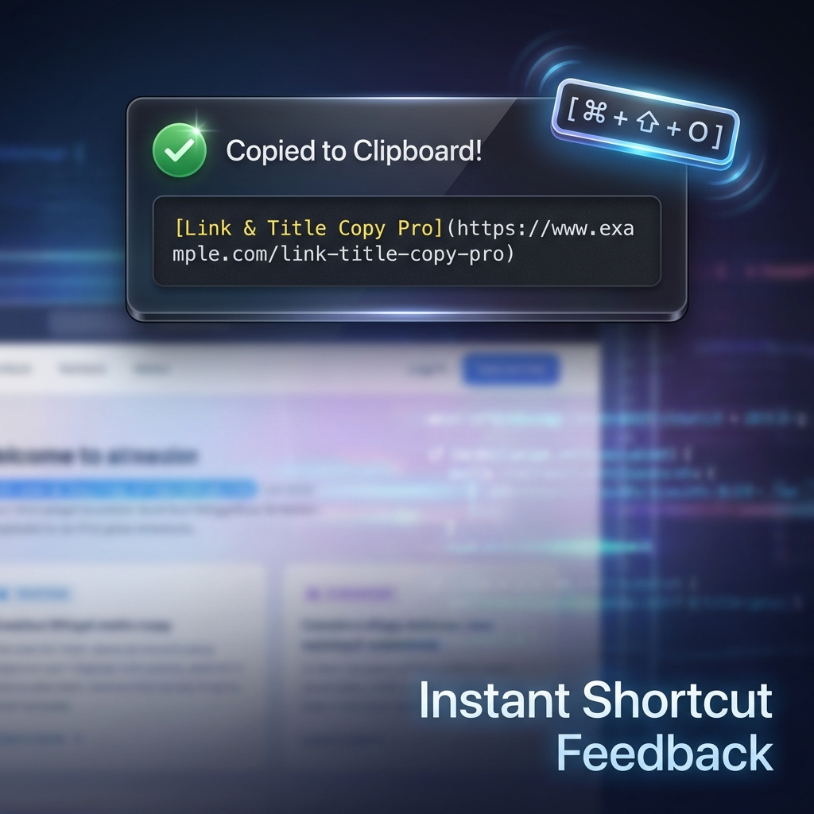
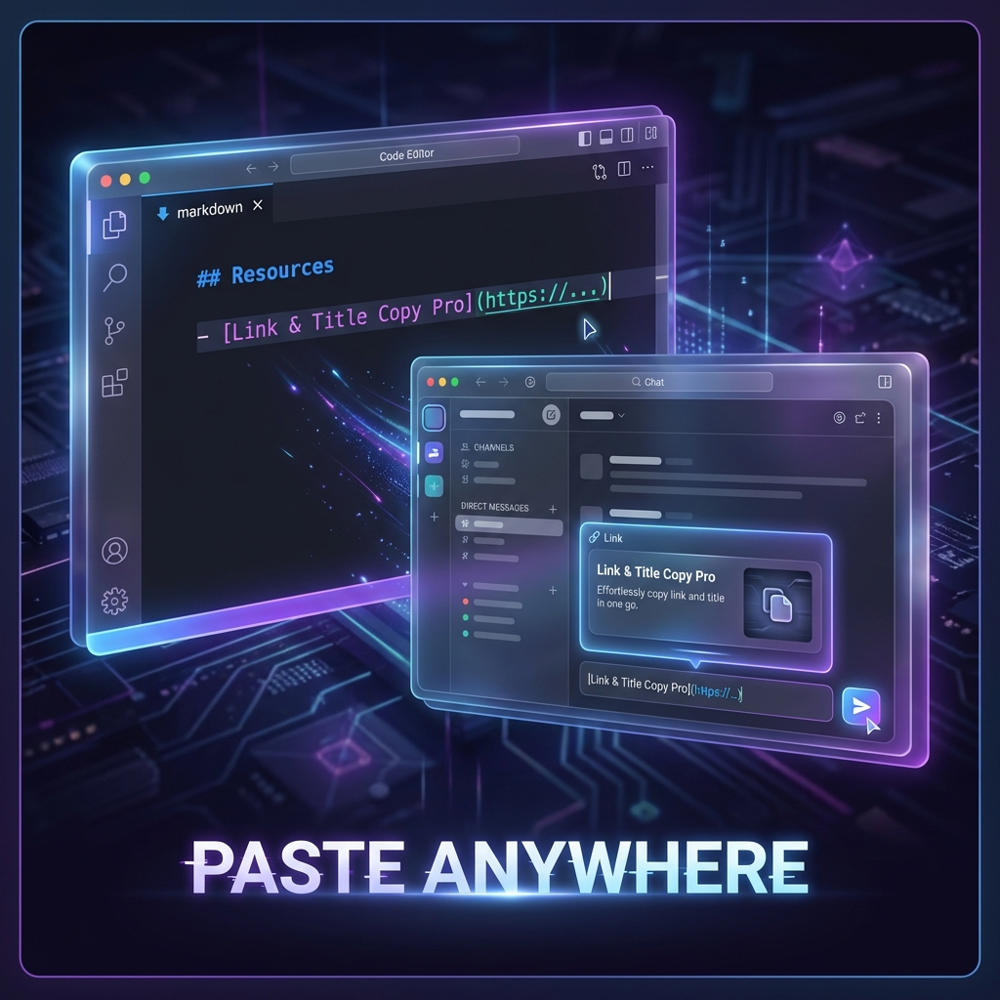
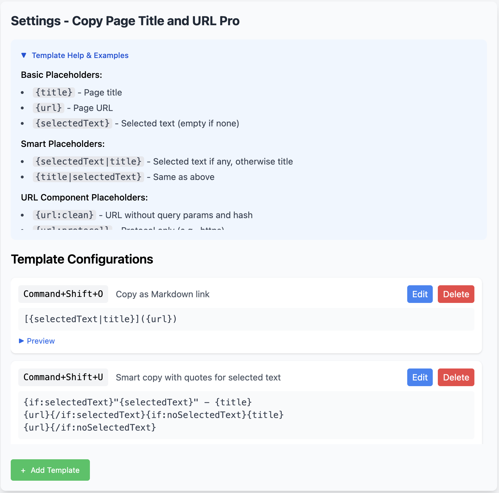

# Link & Title Copy Pro

- [Link & Title Copy Pro Website](https://app.lideguang.com/link-and-title-copy-pro/)

Link&TitleCopyPro is a browser extension that allows you to copy both the title and URL link of a browser tab at the same time, with customizable templates and smart features.

Link&TitleCopyPro是一个可以同时复制浏览器标签页的标题和URL链接的浏览器扩展，支持自定义模板和智能功能。

  
  
  

## Features / 功能特性

- [x] Copy title & link / 复制标题和链接
- [x] i18n support (EN, 简中, 繁中, 日本語, Русский, हिंदी) / 国际化支持（6 种语言）
- [x] Copy selected text & link / 复制选中文本和链接
- [x] Custom copy templates / 自定义复制模板
- [x] Custom shortcuts / 自定义快捷键
- [x] Context menu integration / 右键菜单集成
- [x] URL component placeholders / URL 组件占位符
- [x] Conditional templates / 条件模板
- [x] Template autocomplete / 模板自动完成

## Template Placeholders / 模板占位符

### Basic / 基础

- `{title}` - Page title / 页面标题
- `{url}` - Page URL / 页面链接
- `{selectedText}` - Selected text / 选中文本

### Smart / 智能

- `{selectedText|title}` - Selected text if any, otherwise title / 优先选中文本，否则标题
- `{title|selectedText}` - Same as above / 同上
- `{selectedTextWithQuote}` - Selected text wrapped in quotes, or title in quotes if no selection / 带引号的选中文本 (如 `"text"`)
- `{selectedTextWithBrackets}` - Selected text wrapped in brackets / 带方括号的选中文本 (如 `[text]`)
- `{selectedTextWithContext}` - Selected text + Title / 选中文本 + 标题 (如 `Selected Text - Page Title`)

### URL Components / URL 组件

- `{url:short}` - Shortest link that still works: tracking removed, plus the site's own canonical short form where one exists (Amazon `/dp/`, YouTube `youtu.be`, Stack Overflow `/q/`, Reddit `redd.it`, eBay, Etsy, Walmart, Target, Hobby Lobby) / 可用的最短链接
- `{url:notrack}` - URL with tracking parameters removed, keeping the ones the page needs / 去除追踪参数，保留页面必需的参数
- `{url:clean}` - URL without query params and hash
- `{url:protocol}` - Protocol (e.g., https)
- `{url:domain}` - Domain/hostname
- `{url:path}` - Path only
- `{url:query}` - Query parameters
- `{url:hash}` - Hash fragment
- `{url:origin}` - Protocol + domain

### Conditional / 条件模板

- `{if:selectedText}...{/if:selectedText}` - Show content only when text is selected
- `{selectedText?}...{/selectedText?}` - Shorthand for above / 简写
- `{if:noSelectedText}...{/if:noSelectedText}` - Show content only when no text is selected
- `{noSelectedText?}...{/noSelectedText?}` - Shorthand for above / 简写

## Version History / 版本历史

### v1.12.0

- Link shortening rules are editable in Settings: built-in rules for common sites, plus your own for anywhere else, with a test box that shows the result as you type / 短链规则可在设置中编辑：内置常见站点规则，也可自行添加，并带实时测试框

### v1.11.0

- New `{url:short}` gives the shortest link that still works — tracking removed, plus the site's own short form on Amazon, YouTube, Stack Overflow, Reddit, eBay, Etsy, Walmart, Target and Hobby Lobby / 新增 `{url:short}`：可用的最短链接，去除追踪并在支持的站点使用其官方短链形式

### v1.10.3

- Completes the [#4](https://github.com/Deguang/link-and-title-copy-pro/issues/4) fix: a hidden iframe with nothing selected now declines the copy instead of racing for the clipboard / 补全 [#4](https://github.com/Deguang/link-and-title-copy-pro/issues/4)：无选中内容的隐藏 iframe 不再参与复制

### v1.10.2

- A hidden iframe (e.g. Stripe.js) no longer copies its own URL over the page's / 页面内隐藏 iframe（如 Stripe.js）不再覆盖为自身地址 ([#4](https://github.com/Deguang/link-and-title-copy-pro/issues/4))

### v1.10.1

- No more console errors on pages that were open when the extension updated / 修复扩展更新后，已打开页面报控制台错误的问题

### v1.10.0

- Batch copy has eight layouts: separate lines, bullets, task list, numbered, Markdown table, HTML table, CSV, JSON / 批量复制支持八种排列方式：分行、项目符号、任务清单、编号、Markdown 表格、HTML 表格、CSV、JSON
- Multi-line entries are separated by a blank line, so one tab ends where the next begins / 多行条目之间以空行分隔，条目边界清晰
- The tab list has room again — the popup uses the full height and the preview folds away / 标签列表恢复空间：弹窗用满可用高度，预览可折叠

### v1.9.0

- New `{url:notrack}` removes tracking parameters while keeping the ones the page needs / 新增 `{url:notrack}`，去除追踪参数但保留页面必需的参数
- New installs get a clean-link template, ready to use / 新安装自带「干净链接」模板
- The popup copies the tabs you selected in the tab strip / 弹窗会复制你在标签栏中选中的标签页
- The right-click menu no longer lists every template twice / 右键菜单不再重复列出每个模板
- Shortcuts can be cleared, and are now optional / 快捷键可以清除，且改为可选

### v1.8.0

- Shortcuts now work on the new tab page, chrome:// pages and the Web Store, where nothing was listening before / 快捷键现在在新标签页、chrome:// 页面和应用商店也能用
- The right-click menu works again — its click handler had been missing, making every entry inert / 右键菜单恢复可用（此前点击无任何反应）
- Right-click any link to copy it in your format without opening it / 右键任意链接，直接以你的格式复制
- Onboarding no longer traps you for eight seconds when a shortcut is taken / 引导页不再在快捷键被占用时卡住

### v1.7.3

- Onboarding validates the shortcut through the same matcher as the extension itself / 引导页改用与扩展一致的快捷键匹配逻辑
- Removed a second, stale copy of the default configs that nothing read / 删除一份无人引用且已过时的默认配置副本

### v1.7.2

- Onboarding moved onto the design system; it stays dark by intent, using the same navy palette / 引导页并入设计系统，保持深色但改用同一套藏青色板
- Content scripts survive an extension update without throwing in already-open tabs / 扩展更新后，已打开标签页的脚本不再报错
- Removed a dead script reference and the module preloads Chrome rejects on extension pages / 移除失效脚本引用与扩展页无效的预载标签

### v1.7.0

- Redesigned popup and settings around a design system derived from the product mark / 基于产品图标反推的设计系统，重做弹窗与设置页
- Light and dark themes across both surfaces, following the OS / 两个界面均支持浅色/深色，跟随系统
- Settings rebuilt as master–detail with auto-save; the Save/Cancel buttons are gone / 设置页改为主从分栏 + 即时保存，去掉保存/取消按钮
- Non-blocking validation flags unreachable shortcuts, duplicates, and unknown placeholders / 非阻断式校验：无效快捷键、重复绑定、未知占位符
- One shortcut renderer for every surface; modifier keys draw as SVG / 三个界面统一快捷键渲染，修饰键改用 SVG
- Windows no longer shows macOS-only glyphs for Command and the Win key / Windows 不再显示 macOS 专属符号
- Bundled JetBrains Mono for templates and keycaps (Latin subset, ~42KB) / 内置 JetBrains Mono 用于模板与键帽
- Fixed dropped keystrokes when typing quickly in settings / 修复设置页快速输入时丢字符

> Storage format is unchanged — existing templates and shortcuts carry over untouched.
> 存储结构未变，已有模板与快捷键原样沿用。

### v1.2.1

- Interactive onboarding page on first install / 首次安装时展示交互式引导页
- OS detection with real-time shortcut validation / 自动检测系统并实时验证快捷键
- Template preview with per-shortcut copy feedback / 模板预览，按下快捷键直接复制内容
- Full i18n for onboarding (en, zh_CN, zh_TW, ja, ru, hi) / 引导页完整多语言支持
- Remove unused scripting permission / 移除未使用的 scripting 权限

### v1.1.0

- Multi-language support: Japanese, Russian, Hindi, Traditional Chinese / 多语言支持：日语、俄语、印地语、繁体中文
- Landing page i18n with build-time generation / 落地页国际化构建系统
- Google Analytics event tracking for copy actions / 复制操作 GA 事件追踪

### v1.0.0

- Enhanced toast notification with content preview / 增强的 Toast 通知，支持内容预览
- Improved i18n support / 改进国际化支持
- Launch landing page / 上线官网页面

### v0.5.0

- Added URL component placeholders
- Improved configuration page layout
- Complete internationalization
- Template autocomplete feature
- Delete confirmation dialog
- Context menu error fixes

### v0.4.0

- Initial public release
- Custom templates support
- Multiple shortcut configurations

## Design / 设计

Visual language, colour tokens, and the reasoning behind them:
**[docs/design-system.md](docs/design-system.md)**

Values live in `src/styles/tokens.css` and are exposed as semantic Tailwind
utilities (`bg-surface`, `text-ink-2`, `bg-accent`). Components name roles, never
raw hues, so light/dark is a single attribute flip.

## License / 许可证

Source-available under the [PolyForm Noncommercial License 1.0.0](LICENSE). You may
read, use, modify, and share the source for **noncommercial purposes**. Commercial
use — including redistributing or reselling the extension or a derivative, or
removing the Pro license gate — is **not permitted** without a separate commercial
license from the author.

源码公开，采用 [PolyForm Noncommercial License 1.0.0](LICENSE)。允许出于**非商业目的**
查看、使用、修改和分享源码；**商业用途**（包括转售/重新上架本扩展或其衍生版本、移除 Pro
付费校验）须另行获得作者的商业授权。

Pro features are unlocked with a paid license key — see
[Link & Title Copy Pro](https://app.lideguang.com/link-and-title-copy-pro/).
